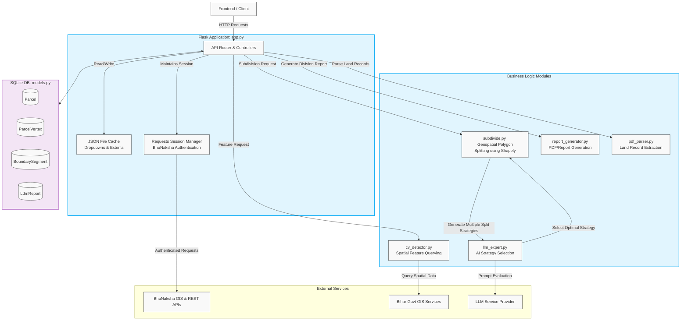

# Backend Architecture

This document outlines the backend architecture of the Bihar Cadastral Map & Satellite Dashboard.

## Architecture Diagram

## Component Breakdown

1. **API Gateway & App Runner (`app.py`)**:
   - Built on Flask, this acts as the central entry point.
   - **Proxies**: Safely forwards geospatial and data requests to the BhuNaksha servers while managing a persistent, authenticated `requests.Session`.
   - **Caching**: Uses simple local JSON files (`dropdown_cache.json`, `extent_cache.json`) to speed up redundant API calls.
   - **Controllers**: Handles data export (`export_geojson`, `export_csv`) and directs complex processes to specific modules.

2. **Database Layer (`models.py`)**:
   - Uses SQLAlchemy to manage an SQLite database (`bhunaksha.db`).
   - Stores parsed parcel geometries (`Parcel`, `ParcelVertex`), boundary constraints (`BoundarySegment`), and generated reports (`LdmReport`).

3. **Core Modules**:
   - **`subdivide.py`**: The geospatial engine for land division (Kurra). It uses the `shapely` library to calculate different ways to slice a polygon based on target ratios and frontage constraints.
   - **`llm_expert.py`**: Acts as a decision engine. Once `subdivide.py` generates multiple valid subdivision strategies, it passes them to an LLM, which evaluates physical constraints (like trees, wells, or river adjacency) to select the most practical division.
   - **`report_generator.py`**: Compiles the final subdivision decisions and parcel data into downloadable reports.
   - **`cv_detector.py`**: Interfaces with external GIS services to detect nearby infrastructure and topological features relevant to a plot.
   - **`pdf_parser.py`**: Extracts text and area metrics directly from uploaded or queried land record PDFs.
