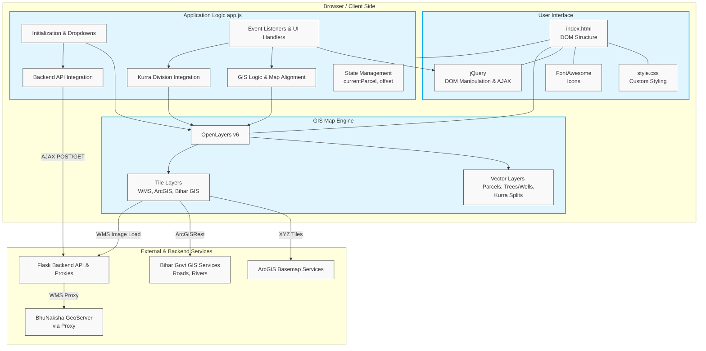

# Frontend Architecture

This document outlines the frontend architecture of the Bihar Cadastral Map & Satellite Dashboard.

## Architecture Diagram

## Component Breakdown

1. **User Interface (`index.html`, `style.css`)**: 
   - A responsive layout with a collapsible sidebar for controls and a main area for the map canvas.
   - External dependencies include jQuery for easy DOM manipulation and FontAwesome for icons.

2. **Map Engine (OpenLayers v6)**:
   - Handles the rendering of complex geospatial data.
   - **Tile Layers**: Fetches map tiles from ArcGIS (Satellite/Labels), Bihar Govt GIS (Highways, Rivers), and custom BhuNaksha WMS via a Flask proxy.
   - **Vector Layers**: Renders dynamic interactive elements like the selected parcel polygon, user-placed objects (trees, wells), and generated Kurra (subdivision) splits.

3. **Application Logic (`app.js`)**:
   - Acts as the controller connecting the UI to the Map Engine and Backend.
   - **State Management**: Maintains current map offsets for visual nudging (`offsetX`, `offsetY`), cached features (`osmFeaturesCache`), and current parcel details.
   - **Event Listeners**: Listens to UI clicks (dropdowns, sliders, map clicks) and triggers corresponding GIS or API actions.
   - **API Integration**: Uses `$.post` and `$.ajax` to communicate with the Flask backend to fetch administrative boundaries, query plots by GPS, and trigger complex subdivision calculations.
